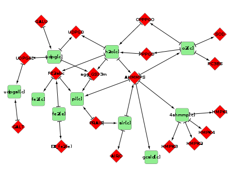

Comparing Geobacter
========================================================

Loading
--------------------------------------------------------
First, we need to load some libraries and data:
```{r, message=FALSE, warning=FALSE}
library('R.matlab')
library('sybil')
library('RCytoscape')
library('reshape2')
library('plyr')
library('dplyr')
library('ggplot2')
library('ggmap')
library('stringr')
library('pingr')
library('kernlab')
library('grid')
library('gridExtra')
library('compiler')
library('GDMOr')
```
```{r, message=FALSE, warning=FALSE}
source('~/Dropbox/cytoscape_paper/graphs.R')
```
```{r, message=FALSE, warning=FALSE}
geo_m_model <- readTSVmod(reactList='../temp/geo_m_react.tsv', col.names=c('name','abbreviation','equation','lowbnd','uppbnd','present','obj_coef','rule','knockoutcost','knockingcost','proteinclass','subsystem'))
geo_s_model <- readTSVmod(reactList='../temp/geo_s_react.tsv', col.names=c('name','abbreviation','equation','lowbnd','uppbnd','present','obj_coef','rule','knockoutcost','knockingcost','proteinclass','subsystem'))
```
Having done this, we've got several datasets:
```{r}
ls()
```
- `geo_*` and `geo_*_all` are population data frames. Rows are individuals, columns are genotypes and phenotypes, as specified by the column name prefixes. `_all` simply represents a larger sample.
- `geo_*_rxns` are the reactions lists, forming the metabolic models.
- `geo_*_pathways_genes` map genes to their pathways. These are pared from the reaction lists.
- `geo_*_model` are `Sybil` models.

Genes to Reactions
-----------------------------------------
Our *Metallireduccens* and *Sulfurreducens* models obviously have different sets of genes:
```{r}
head(colnames(geo_s))
head(colnames(geo_m))
```

Therefore, we must map the gene expression vectors to reactions:
```{r}
geo_s_expressiontable <- dplyr::select(geo_s, contains('genotype'))
geo_m_expressiontable <- dplyr::select(geo_m, contains('genotype'))
colnames(geo_s_expressiontable) <- str_replace(colnames(geo_s_expressiontable),fixed('genotype.'),'')
colnames(geo_m_expressiontable) <- str_replace(colnames(geo_m_expressiontable),fixed('genotype.'),'')

geo_s_rxntable <- gene2rxn(genes=geo_s_expressiontable, model=geo_s_model)
geo_m_rxntable <- gene2rxn(genes=geo_m_expressiontable, model=geo_m_model)
```

This takes a while, but now we've got tables of reaction activations. Let's join them to the main expression tables:
```{r}
geo_s_rxntable_wcolnames <- geo_s_rxntable
geo_m_rxntable_wcolnames <- geo_m_rxntable
colnames(geo_s_rxntable_wcolnames) <- paste('rxn',colnames(geo_s_rxntable), sep='.')
colnames(geo_m_rxntable_wcolnames) <- paste('rxn',colnames(geo_m_rxntable), sep='.')
geo_s <- cbind(geo_s_rxntable_wcolnames, geo_s)
geo_m <- cbind(geo_m_rxntable_wcolnames, geo_m)
```

Analysis
--------------------------------
Now we can do some real analysis. To start with, let's look at average expression values:
```{r}
temp <- geo_s %.% select(starts_with('rxn.')) %.% colMeans() %.% data.frame()
ggplot(temp,aes(rownames(temp),X__prev)) + geom_point()
ggplot(temp,aes(X__prev)) + stat_density()

temp <- geo_m %.% select(starts_with('rxn.')) %.% colMeans() %.% data.frame()
ggplot(temp,aes(rownames(temp),X__prev)) + geom_point()
ggplot(temp,aes(X__prev)) + stat_density()
```
Nothing terribly enlightening there. I also tried density plots with the spike at 1 excluded, but it still wasn't very interesting.

Let's only look at reactions that occur in both species, and see how they correlate with synthesis in each case:
```{r}
commonreactions <- intersect(grep(pattern='^rxn',x=colnames(geo_s), value=TRUE),
													 grep(pattern='^rxn',x=colnames(geo_m), value=TRUE)
													 ) %.% str_replace(pattern='rxn.', replacement='')

geo_s_correlations <- data.frame(stringsAsFactors=FALSE,
																 rxn=commonreactions, 
																 cor=cor(geo_s[,paste0('rxn.',commonreactions)], geo_s[,'phenotype.fe2']),
																 species='sul'
																 )
geo_m_correlations <- data.frame(stringsAsFactors=FALSE,
																 rxn=commonreactions, 
																 cor=cor(geo_m[,paste0('rxn.',commonreactions)], geo_m[,'phenotype.fe2']),
																 species='met'
																 )

geo_m_correlations <- merge(geo_m_correlations, geo_m_rxns, by.x='rxn', by.y='Abbreviation')
geo_s_correlations <- merge(geo_s_correlations, geo_s_rxns, by.x='rxn', by.y='Abbreviation')
```
Now we'll join them together and compare:
```{r}
correlations <- rbind(geo_s_correlations, geo_m_correlations)

ggplot(correlations, aes(x=rxn, y=cor, colour=species)) + geom_point() + coord_flip()
```
Now this is getting interesting. We can see that the activations of the reactions in sulfurreducens are much more spread out than in metallireduccens. We'll check this with a kde:
```{r}
ggplot(correlations, aes(x=cor, colour=factor(species))) + geom_density()
```
This might help to understand why sulfurreducens is capable of much more adaptation towards high synthesis, and simultaneously why metallireducens has higher biomass production.

Now, we'll try to look at the individual reactions more. Specifically, do reactions have similar correlations with synthesis in the two species?
```{r activites}
dcast(correlations, rxn ~ species, fun.aggregate=function(x){mean(x,na.rm=TRUE)}, value.var='cor') %.%
	ggplot(aes(x=met, y=sul)) + geom_point() + coord_cartesian(c(-1,1),c(-1,1))
```
The answer is no, at least looking at this level, most reactions don't display a strong similarity between their activity in the two species. However, we can see an interesting outlier that has highly suppressed activity in Metalireducens, but not in Sulfurreducens. Now we'll pick it out:
```{r}
outliers <- correlations %.% filter(cor > 0.5, species == 'met')
```
In fact, there are two reactions at this point. What do they do?
```{r}
geo_m_rxns %.% filter(Abbreviation %in% str_replace(outliers$rxn, fixed('rxn.'), ''))
```
These reactions are investigated more in the local analysis section.

We can also try visualizing reactions regulation aggregated by subsystem and species:
```{r}
ggplot(correlations, aes(x=tolower(SubSystem), y=cor, colour=factor(species))) + geom_boxplot() + coord_flip()
```

And producing a pretty, stacked plot:
```{r correlation_reaction_pathway}
a <- ggplot(correlations, aes(x=cor, colour=factor(species))) + 
	geom_density() + 
	theme_bw() +
	theme(legend.position = "none", 
				axis.title = element_blank(), 
				axis.text = element_blank()
				)
b <- ggplot(correlations, aes(x=tolower(SubSystem), y=cor, colour=factor(species))) + 
	geom_boxplot() + 
	coord_flip() + 
	theme_bw() +
	theme(legend.position = "none", 
				axis.title = element_blank()
				)
A <- ggplotGrob(a)
B <- ggplotGrob(b)
A$widths <- B$widths
grid.arrange(A,B,heights=c(1,5))
```


Local Analysis
---------------------------------------------
First, Cytoscape needs to be initialized
```{r, eval=FALSE}
CytoscapeConnection()
sulwin <- cytoscape_load(geo_s_model)
metwin <- cytoscape_load(geo_m_model)
```

### AHMMPS and UDPG4E
To try and see why these reactions are outlying in Metallireducens but not in Sulfurreducens, let's view them both, on both networks, in Cytoscape.
```{r, eval=FALSE}
selectNodes(sulwin,str_replace(outliers$rxn, fixed('rxn.'), ''))
selectNodes(metwin,str_replace(outliers$rxn, fixed('rxn.'), ''))
```



It appears that the reason for strong correlations in Metallireducens but not in Sulfurreducens may be due to the existence of PPPGO in Metallireducens, and a mechanism involving water availability.

We can look at the activity against synthesis directly:
```{r}
rbind(data.frame(geo_s[, c(outliers$rxn,'phenotype.fe2','phenotype.biomass')], 
								 species='sul'
								 ),
			data.frame(geo_m[, c(outliers$rxn,'phenotype.fe2','phenotype.biomass')], 
								 species='met'
								 )
			) %.%
	melt(id.vars=c('phenotype.biomass','phenotype.fe2','species'), variable.name='rxn', value.name='activity') %.%
	ggplot(aes(x=activity, y=phenotype.fe2)) + geom_point() + facet_grid(rxn~species)
```

### Iron-II excretion
Another approach is to focus in on the neighbourhood of a single reaction. For instance Iron-II excretion.
First, we select the correct nodes. node selection could be done in cytoscape, but picking a single reaction from a whole network is tricky, so I've done it in R.
```{r, eval=FALSE}
selectNodes(sulwin,'EX_fe2(e)')
selectNodes(metwin,'EX_fe2(e)')
```
This gives a global network diagram something like this:


This global network is obviously completely unintelligible, so in cytoscape, we select the neighbourhood of Iron-II excretion, to a depth of four, but ignoring links from very highly used molecules, such as water and hydrogen ions. This gives a total of nine reactions.

This local network looks as follows (the same network was selected from both species; red dimaonds are reactions, green rectangles are metabolites):


Having identified these reactions, we can pull them back from Cytoscape to R, and for each one, we can see how their activity correlates with synthesis.
```{r, eval=FALSE}
neighbourhood_rxns <- intersect(geo_s_model@react_id,getSelectedNodes(sulwin))
```
```{r, include=FALSE}
neighbourhood_rxns <- c("CYCPO", "CYOR1m", "FCLT", "FE2abc", "FERCYT", "NTRIRfc", "SHCHF", "EX_fe2(e)", "EX_fe3(e)")
```
```{r}
neighbourhood_rxns
rbind(data.frame(geo_s[, c(paste('rxn',neighbourhood_rxns,sep='.'),'phenotype.fe2','phenotype.biomass')], 
								 species='sul'
								 ),
			data.frame(geo_m[, c(paste('rxn',neighbourhood_rxns,sep='.'),'phenotype.fe2','phenotype.biomass')], 
								 species='met'
								 )
			) %.%
	melt(id.vars=c('phenotype.biomass','phenotype.fe2','species'), variable.name='rxn', value.name='activity') %.%
	ggplot(aes(x=activity, y=phenotype.fe2, colour=rxn)) + geom_point() + facet_wrap(~species, scales='free')
```


